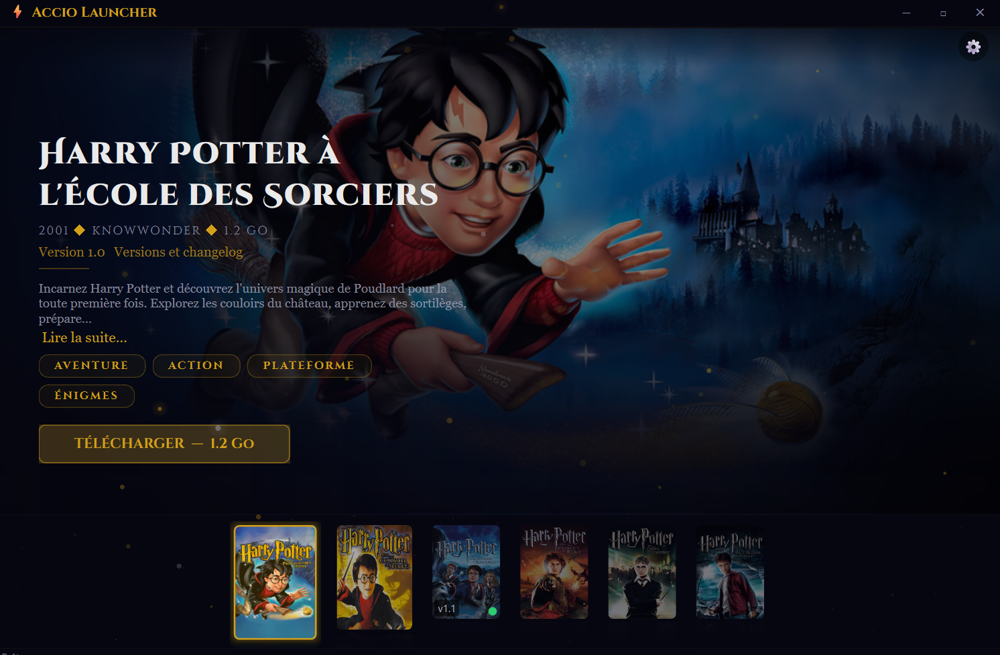
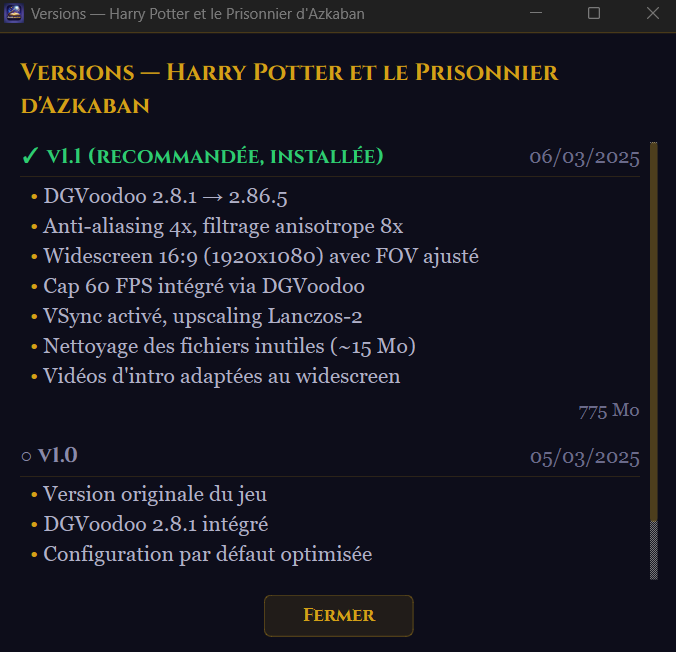

<div align="center">

# ⚡ Accio Launcher

### Le launcher magique pour les jeux Harry Potter PC

[](https://github.com/ludvdber/AccioLauncher/releases)
[](https://python.org)
[](https://pypi.org/project/PyQt6/)
[](https://microsoft.com)
[](LICENSE)

*Je jure solennellement que mes intentions sont mauvaises.* 🗺️

[**⬇ Télécharger**](https://github.com/ludvdber/AccioLauncher/releases) · [🐛 Signaler un bug](https://github.com/ludvdber/AccioLauncher/issues) · [💡 Demander une feature](https://github.com/ludvdber/AccioLauncher/issues/new)

</div>

---

<div align="center">
  
  <br><br>
  <sub><i>Interface du launcher — carrousel, particules magiques et effets de parallaxe</i></sub>
</div>

---

## ✨ Fonctionnalités

| | |
|---|---|
| 🎮 **6 jeux Harry Potter PC** | De l'École des Sorciers (2001) au Prince de Sang-Mêlé (2009) |
| ⬇️ **Téléchargement en un clic** | Téléchargement, extraction 7z et installation automatiques |
| 🎨 **UI immersive style AAA** | Particules magiques, parallaxe, transitions cinématiques, glow doré |
| 📺 **Fonds vidéo** | Vidéos de présentation en arrière-plan avec boucle automatique |
| 🔄 **Versioning et changelog** | Suivi des versions avec historique détaillé des changements |
| 📥 **System tray intelligent** | Se minimise pendant le jeu, se restaure automatiquement |
| ⚙️ **Paramètres intégrés** | Dossier d'installation, gestion de l'espace disque, préférences |
| 🛡️ **Code audité** | HTTPS only, anti path-traversal, Zip Slip prevention, thread safety |

---

## 🎮 Jeux supportés

| # | Jeu | Année | Développeur | Taille |
|:-:|-----|:-----:|:-----------:|:------:|
| I | Harry Potter à l'École des Sorciers | 2001 | KnowWonder | ~1.2 Go |
| II | Harry Potter et la Chambre des Secrets | 2002 | KnowWonder | ~2.5 Go |
| III | Harry Potter et le Prisonnier d'Azkaban | 2004 | KnowWonder | ~2.8 Go |
| IV | Harry Potter et la Coupe de Feu | 2005 | EA UK | ~3.5 Go |
| V | Harry Potter et l'Ordre du Phénix | 2007 | EA UK | ~4.2 Go |
| VI | Harry Potter et le Prince de Sang-Mêlé | 2009 | EA UK | ~4.5 Go |

> *Harry Potter et les Reliques de la Mort (Parties I & II) et Coupe du Monde de Quidditch arrivent dans une future mise à jour.*

---

## 🚀 Installation

### 💎 Méthode simple

1. Téléchargez **AccioLauncher.exe** depuis les [Releases](https://github.com/ludvdber/AccioLauncher/releases)
2. Lancez l'exécutable
3. Choisissez votre dossier d'installation
4. Sélectionnez un jeu et cliquez sur **Télécharger** ⚡

### 🧙 Méthode développeur

```bash
git clone https://github.com/ludvdber/AccioLauncher.git
cd AccioLauncher
pip install -r requirements.txt
python main.py
```

> **Prérequis :** Python 3.12+, Windows 10/11

<details>
<summary><b>📦 Builder l'exécutable</b></summary>

```bash
pip install -r requirements-dev.txt
build.bat
# → dist/AccioLauncher.exe
```

</details>

---

## 📸 Captures d'écran

<div align="center">
  <table>
    <tr>
      <td></td>
      <td></td>
    </tr>
    <tr>
      <td align="center"><sub>Vue détaillée avec parallaxe</sub></td>
      <td align="center"><sub>Carrousel avec reflets et étoiles</sub></td>
    </tr>
    <tr>
      <td></td>
      <td></td>
    </tr>
    <tr>
      <td align="center"><sub>Téléchargement en cours</sub></td>
      <td align="center"><sub>Historique des versions</sub></td>
    </tr>
  </table>
</div>

---

## 🛠️ Stack technique

| Composant | Technologie |
|-----------|------------|
| **Langage** | Python 3.12+ avec type hints modernes |
| **Interface** | PyQt6 — widgets custom, QPainter, QPropertyAnimation |
| **Téléchargement** | httpx — streaming HTTPS avec suivi de progression |
| **Extraction** | py7zr — support archives 7z et zip |
| **Effets visuels** | Particules, parallaxe, glow, transitions — tout en QPainter natif |
| **Architecture** | Séparation `core/` (logique métier) et `ui/` (interface) |
| **Packaging** | PyInstaller — exécutable unique Windows |

---

## 🗺️ Roadmap

- [x] **V1** — Launcher + carrousel + téléchargement + system tray + versioning
- [ ] **V2** — Configuration graphique intégrée (DGVoodoo, résolution, compatibilité)
- [ ] **V3** — Patches et corrections de bugs spécifiques aux jeux
- [ ] **V4** — Support Linux (Wine / Proton)
- [ ] **V5** — Internationalisation FR / EN

---

## 🤝 Contribution

Les contributions sont les bienvenues !

- 🐛 **Bug ?** → Ouvrez une [Issue](https://github.com/ludvdber/AccioLauncher/issues)
- 💡 **Idée ?** → Proposez une [Feature Request](https://github.com/ludvdber/AccioLauncher/issues/new)
- 🔧 **Code ?** → Forkez, créez une branche, soumettez une PR

---

## ⚖️ Avertissement légal

> Ce projet est un **launcher communautaire non-officiel** créé par des fans.
> Les jeux Harry Potter sont la propriété de **Warner Bros. Games** et **Electronic Arts**.
> Harry Potter est une marque déposée de **Warner Bros. Entertainment Inc.**
>
> Accio Launcher **ne contient aucun fichier de jeu** — il facilite uniquement
> l'installation et le lancement de jeux considérés comme abandonware.
>
> Ce projet n'est ni affilié, ni approuvé par Warner Bros., EA ou J.K. Rowling.

---

<div align="center">

Fait avec 🪄 et beaucoup de ☕

*Méfait accompli.* 🗺️

</div>

---

<details>
<summary><b>🇬🇧 English</b></summary>

<br>

### Accio Launcher

A magical desktop launcher for Harry Potter PC games (2001–2009). Features one-click download & install, immersive AAA-style UI with particles, parallax and cinematic transitions, video backgrounds, version tracking with changelog, smart system tray minimization during gameplay, and security-audited code.

**Quick start:** Download `AccioLauncher.exe` from [Releases](https://github.com/ludvdber/AccioLauncher/releases), run it, pick your install folder, and you're ready to play.

**Dev setup:** `git clone` → `pip install -r requirements.txt` → `python main.py`

Built with Python 3.12+, PyQt6, httpx, and py7zr. Windows 10/11 only (Linux support planned).

</details>
