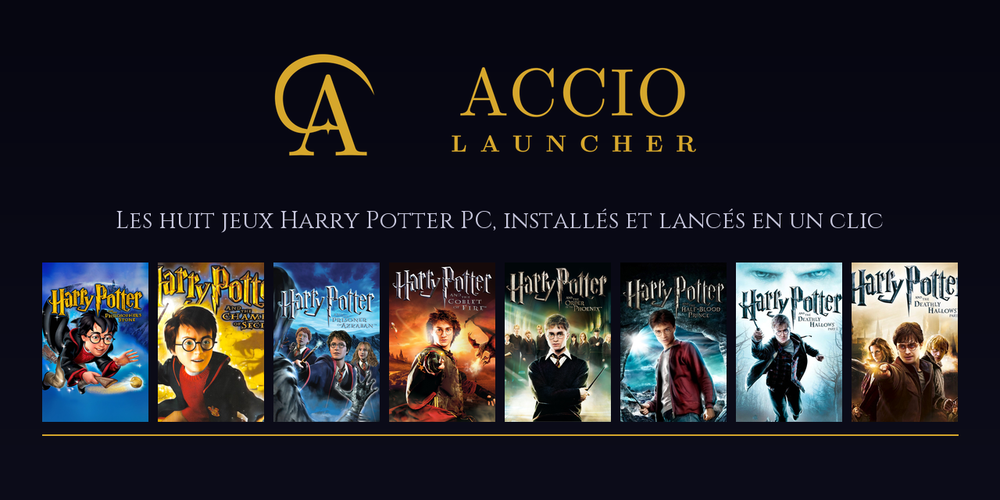
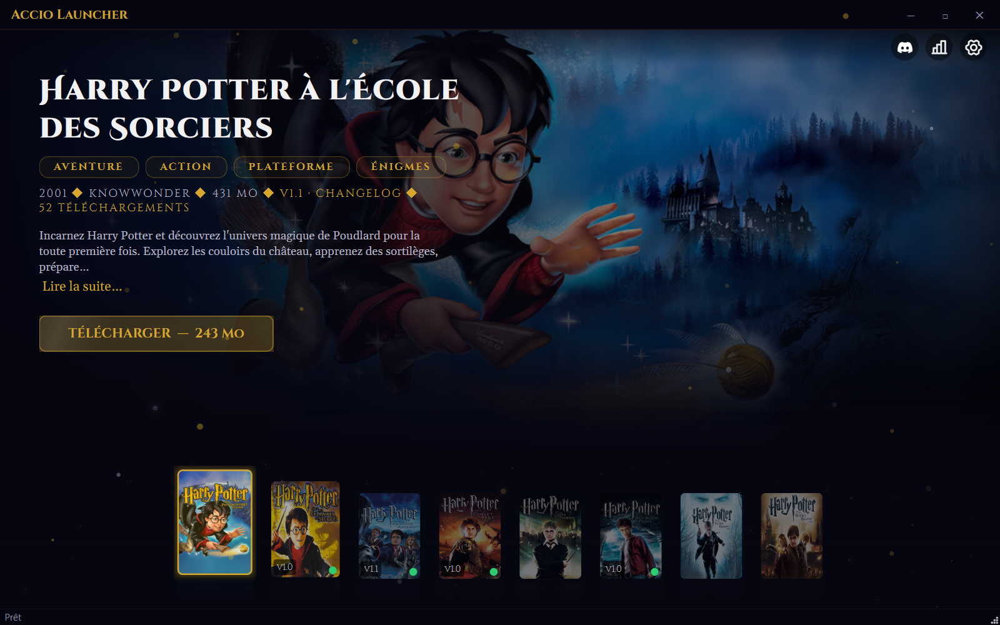
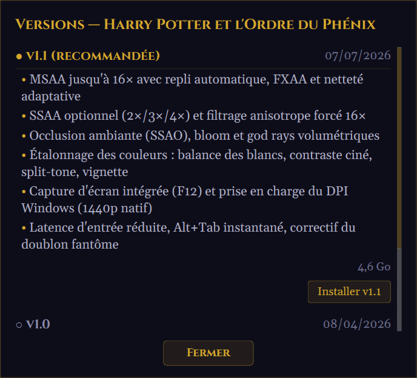

<div align="center">

# ⚡ Accio Launcher

### Le launcher magique pour les jeux Harry Potter PC

[](https://github.com/ludvdber/AccioLauncher/releases)
[](https://python.org)
[](https://pypi.org/project/PyQt6/)
[](https://microsoft.com)
[](LICENSE)
[](docs/THIRD-PARTY-NOTICES.md)
[](https://github.com/ludvdber/AccioLauncher/actions/workflows/tests.yml)

*Je jure solennellement que mes intentions sont mauvaises.* 🗺️

[**⬇ Télécharger**](https://github.com/ludvdber/AccioLauncher/releases) · [🐛 Signaler un bug](https://github.com/ludvdber/AccioLauncher/issues) · [💡 Demander une feature](https://github.com/ludvdber/AccioLauncher/issues/new)

</div>

---

<div align="center">
  
</div>

---

## ✨ Fonctionnalités

| | |
|---|---|
| 🎮 **8 jeux au catalogue** | De l'École des Sorciers (2001) aux Reliques de la Mort (2011) — 6 jouables, 2 en préparation |
| ⬇️ **Téléchargement en un clic** | Reprise après coupure, archives multi-volumes, extraction et installation automatiques |
| 🔒 **Archives vérifiées** | Empreinte SHA-256 contrôlée pendant le téléchargement, sans attente supplémentaire |
| 🎨 **UI immersive style AAA** | Particules magiques, parallaxe, transitions cinématiques, glow doré |
| 🏰 **5 thèmes de maison** | Poudlard (or), Gryffondor, Serpentard, Serdaigle, Poufsouffle |
| 🍂 **Ambiances saisonnières** | Braises d'Halloween en octobre, flocons de Noël en décembre |
| 📺 **Trailers vidéo** | Vidéos de présentation en arrière-plan avec contrôle du volume |
| 🔄 **Versioning et changelog** | Historique détaillé, mise à jour et retour à une version antérieure |
| 🔧 **Vérifier / réparer** | Réinstalle par-dessus une installation abîmée, sans tout recommencer |
| 📥 **System tray intelligent** | Se minimise pendant le jeu, se restaure automatiquement à la sortie |
| ⏱️ **Temps de jeu** | Suivi discret des sessions et de la dernière partie |
| ♻️ **Mise à jour automatique** | Le launcher se met à jour lui-même, en un clic et sans réinstallation |
| 🌍 **Multilingue** | Français, anglais, espagnol — noms, descriptions et changelogs des jeux compris |
| 🛡️ **Code audité** | HTTPS strict, anti path-traversal, protection Zip Slip, thread safety |

---

## 🎮 Jeux supportés

| # | Jeu | Année | Développeur | Archive | État |
|:-:|-----|:-----:|:-----------:|:-------:|:----:|
| I | Harry Potter à l'École des Sorciers | 2001 | KnowWonder | 431 Mo | ✅ Disponible |
| II | Harry Potter et la Chambre des Secrets | 2002 | KnowWonder | 463 Mo | ✅ Disponible |
| III | Harry Potter et le Prisonnier d'Azkaban | 2004 | KnowWonder | 775 Mo | ✅ Disponible |
| IV | Harry Potter et la Coupe de Feu | 2005 | EA UK | 1,7 Go | ✅ Disponible |
| V | Harry Potter et l'Ordre du Phénix | 2007 | EA UK | 4,6 Go | ✅ Disponible |
| VI | Harry Potter et le Prince de Sang-Mêlé | 2009 | EA UK | 4,4 Go | ✅ Disponible |
| VII | Harry Potter et les Reliques de la Mort — Partie 1 | 2010 | EA Bright Light | ~5 Go | 🔜 En préparation |
| VIII | Harry Potter et les Reliques de la Mort — Partie 2 | 2011 | EA Bright Light | ~5,5 Go | 🔜 En préparation |

> **Archive** désigne la taille du téléchargement. Prévoyez le double d'espace libre
> pendant l'installation : l'archive et les fichiers extraits cohabitent jusqu'au
> nettoyage final. Le launcher vous prévient si la place manque, avant le clic.

---

## 🚀 Installation

### 💎 Méthode simple

1. Téléchargez **AccioLauncher.exe** depuis les [Releases](https://github.com/ludvdber/AccioLauncher/releases)
2. Lancez l'exécutable
3. L'assistant vous demande votre langue, votre dossier d'installation, et détecte les jeux que vous possédez déjà
4. Sélectionnez un jeu et cliquez sur **Télécharger** ⚡

### 🛡️ « Windows a protégé votre ordinateur »

C'est attendu, et ce n'est pas un virus.

Accio Launcher est un projet libre et gratuit : il n'est pas signé par un
certificat de signature de code, qui coûte plusieurs centaines d'euros par an.
Windows SmartScreen affiche donc un avertissement pour tout exécutable qu'il ne
connaît pas encore. L'avertissement disparaîtra de lui-même à mesure que le
launcher sera téléchargé.

**Pour lancer le launcher malgré l'avertissement :** cliquez sur
**Informations complémentaires**, puis sur **Exécuter quand même**.

**Pour vérifier vous-même que le fichier est authentique**, comparez son
empreinte avec celle publiée sur la page de la release :

```powershell
Get-FileHash .\AccioLauncher.exe -Algorithm SHA256
```

Si l'empreinte ne correspond pas à celle annoncée, **ne lancez pas le fichier**
et signalez-le sur le [Discord](https://discord.gg/TNwDQd7KGe).

### 🧙 Méthode développeur

```bash
git clone https://github.com/ludvdber/AccioLauncher.git
cd AccioLauncher
pip install -r requirements.txt
python main.py
```

> **Prérequis :** Python 3.12+, Windows 10/11.
> Le plancher n'est pas décoratif : le code utilise `enum.StrEnum`, apparu en 3.11.

<details>
<summary><b>📦 Builder l'exécutable</b></summary>

```bash
pip install -r requirements-dev.txt
build.bat
# → dist/AccioLauncher.exe
```

`build.bat` détecte Python 3.14, puis 3.13, puis 3.12, et enchaîne quatre étapes :
génération de l'icône → lint → tests → PyInstaller. **Il s'arrête à la première
qui échoue** : un exécutable publié avec une régression coûte bien plus cher que
les vingt secondes de vérification.

</details>

<details>
<summary><b>🧪 Lancer les tests et le lint</b></summary>

```bash
pip install -r requirements-dev.txt
python -m pytest          # 430 tests, sans écran (offscreen)
python -m ruff check .
```

Le jeu de règles ruff est **figé dans `pyproject.toml`**. Sans ça, « le projet est
propre » dépendrait du défaut de la version de ruff installée — le passage de 0.15
à 0.16 a fait apparaître 119 signalements sans qu'une seule ligne de code change.

</details>

---

## 📸 Captures d'écran

<div align="center">
  
  <br>
  <sub><i>Vue principale — carrousel, particules magiques et effets de parallaxe</i></sub>
  <br><br>
  <table>
    <tr>
      <td></td>
      <td></td>
    </tr>
    <tr>
      <td align="center"><sub>Jeu installé — vidéo en fond et contrôle audio</sub></td>
      <td align="center"><sub>Gestion des versions et changelog</sub></td>
    </tr>
  </table>
</div>

---

## 🛠️ Stack technique

| Composant | Technologie |
|-----------|------------|
| **Langage** | Python 3.12+ avec type hints modernes |
| **Interface** | PyQt6 6.11 — widgets custom, QPainter, QPropertyAnimation |
| **Téléchargement** | httpx — streaming HTTPS avec reprise et suivi de progression |
| **Extraction** | 7z.exe bundlé — archives 7z (multi-volumes incl.) et zip |
| **Effets visuels** | Particules, parallaxe, glow, transitions — tout en QPainter natif |
| **Architecture** | Séparation `core/` (logique métier) et `ui/` (interface) |
| **Qualité** | ruff + 430 tests pytest, exécutés en CI à chaque push |
| **Packaging** | PyInstaller — exécutable unique Windows |

---

## 🗺️ Roadmap

Le numéro de version suit le catalogue : `0.0.x` correctif · `0.x.0` nouveau jeu ·
`x.0.0` catalogue complet.

- [x] **Socle** — carrousel, téléchargement repris, extraction, versioning, system tray
- [x] **Confiance** — vérification SHA-256, réparation d'installation, rapport de crash en un clic, mise à jour automatique du launcher
- [x] **Confort** — thèmes de maison, ambiances saisonnières, temps de jeu, assistant de premier lancement
- [x] **Internationalisation** — FR / EN / ES, catalogue traduit compris ([contribuez une langue !](docs/TRANSLATORS.md))
- [ ] **0.6 → 0.7** — Reliques de la Mort, parties 1 et 2 : les deux derniers jeux
- [ ] **1.0** — catalogue complet, les 8 jeux en ligne
- [ ] **Après 1.0** — support Linux : launcher natif, puis lancement des jeux via Wine / Proton
- [ ] **Ensuite** — configuration graphique intégrée (résolution, wrapper D3D, compatibilité)

> Le support Linux vient **après** le dernier jeu, délibérément : finir le catalogue
> profite à tout le monde tout de suite, alors qu'un portage à moitié fait ne profite
> à personne. Le code est déjà écrit dans cette perspective — tout appel spécifique à
> Windows est isolé derrière un test de plateforme avec un repli.

---

## 🤝 Contribution

Les contributions sont les bienvenues !

- 🐛 **Bug ?** → Ouvrez une [Issue](https://github.com/ludvdber/AccioLauncher/issues)
- 💡 **Idée ?** → Proposez une [Feature Request](https://github.com/ludvdber/AccioLauncher/issues/new)
- 🔧 **Code ?** → Forkez, créez une branche, soumettez une PR
- 🌍 **Une langue ?** → Voir ci-dessous

### 🌍 Traduire le launcher

Le launcher parle **français, anglais et espagnol**. Toute autre langue est la
bienvenue, et **il n'y a pas une ligne de Python à écrire** : les traductions
sont de simples fichiers de données.

En résumé : copiez [`src/data/i18n/en.json`](src/data/i18n/en.json) sous le code
de votre langue (`de.json`, `pt.json`, `ja.json`…), traduisez les valeurs de
droite en laissant les clés françaises intactes, puis déposez le fichier dans
`%USERPROFILE%\Games\AccioLauncher\i18n\` pour **le voir en direct dans le
launcher**, sans build ni release. Quand le résultat vous convient, ouvrez une PR.

Une traduction incomplète est acceptée : ce qui manque retombe sur l'anglais,
puis sur le français — jamais sur du vide.

👉 **Le guide complet est dans [docs/TRANSLATORS.md](docs/TRANSLATORS.md)**, qui liste
aussi les personnes ayant déjà contribué une langue. Merci à elles ❤

---

## 📜 Licence

**Le code source est sous licence [MIT](LICENSE).** Reprenez-le, modifiez-le,
réutilisez-le — y compris commercialement. La seule condition est de conserver
la mention de copyright, c'est-à-dire de créditer ASTeam comme base du travail.

**L'exécutable distribué est sous GNU GPL v3.** Ce n'est pas un second choix
mais une conséquence : il embarque PyQt6, publié sous GPL v3, ce qui rend le
binaire assemblé dérivé de celle-ci. Le code source correspondant reste
disponible dans ce dépôt, ce qui satisfait l'obligation.

Les deux ne se contredisent pas : qui récupère le code depuis le dépôt l'obtient
sous MIT ; seul le binaire assemblé porte la GPL v3.

Les composants tiers embarqués (7-Zip, Qt, httpx, polices Cinzel…) et leurs
licences respectives sont détaillés dans
[docs/THIRD-PARTY-NOTICES.md](docs/THIRD-PARTY-NOTICES.md).

---

## ⚖️ Avertissement légal

Accio Launcher est un outil de gestion et de lancement de jeux. **Aucun fichier de jeu n'est inclus dans le launcher.**

L'utilisation de ce logiciel implique que vous possédez une copie légale des jeux que vous installez via le launcher. Il est de votre entière responsabilité de vous assurer que vous disposez des droits nécessaires pour utiliser ces jeux dans votre juridiction.

Les jeux Harry Potter sont la propriété intellectuelle de Warner Bros. Entertainment Inc. et Electronic Arts Inc. Ce projet n'est ni affilié, ni approuvé, ni sponsorisé par ces entreprises.

Le développeur d'Accio Launcher ne peut être tenu responsable de l'utilisation qui est faite de ce logiciel par ses utilisateurs. Ce projet est fourni "tel quel", sans garantie d'aucune sorte.

---

<div align="center">

Fait avec 🪄 et beaucoup de ☕

*Méfait accompli.* 🗺️

</div>

---

<details>
<summary><b>🇬🇧 English</b></summary>

<br>

### Accio Launcher

A magical desktop launcher for the Harry Potter PC games (2001–2011). Eight games
in the catalogue, six playable today. One-click download and install with resume
and SHA-256 verification, an immersive AAA-style UI with particles, parallax and
cinematic transitions, video backgrounds, five Hogwarts house themes, seasonal
effects, version tracking with changelog and rollback, playtime stats, smart
system tray minimisation during gameplay, one-click launcher self-update, and
security-audited code.

**Quick start:** download `AccioLauncher.exe` from
[Releases](https://github.com/ludvdber/AccioLauncher/releases), run it, follow the
first-run wizard (language, install folder, detection of games you already own),
then pick a game and hit Download.

**Dev setup:** `git clone` → `pip install -r requirements.txt` → `python main.py`

Built with Python 3.12+, PyQt6 6.11 and httpx (7z.exe bundled). Windows 10/11 for
now — **Linux support is planned once the final game ships**, and every
Windows-specific call is already isolated behind a platform check with a fallback.

**Translators welcome:** adding a language means dropping one JSON file in
`src/data/i18n/` — no Python involved. See [docs/TRANSLATORS.md](docs/TRANSLATORS.md).

</details>
