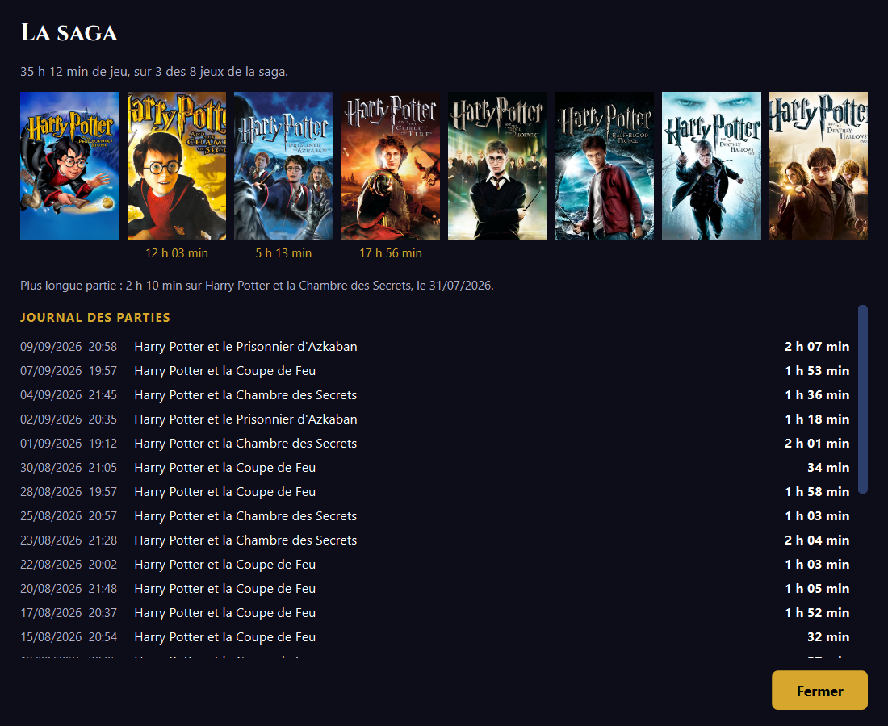

<div align="center">


[](https://github.com/ludvdber/AccioLauncher/actions/workflows/tests.yml)
[](https://github.com/ludvdber/AccioLauncher/actions/workflows/security.yml)
[](https://scorecard.dev/viewer/?uri=github.com/ludvdber/AccioLauncher)
[](https://www.bestpractices.dev/projects/14714)
[](https://github.com/ludvdber/AccioLauncher/releases/latest)
[](https://github.com/ludvdber/AccioLauncher/releases)
[](https://github.com/ludvdber/AccioLauncher/releases/latest)
[](https://discord.gg/TNwDQd7KGe)

**Les huit jeux Harry Potter PC, téléchargés, installés et lancés en un clic.**

### [Télécharger Accio Launcher](https://github.com/ludvdber/AccioLauncher/releases/latest)

Gratuit · Windows 10 et 11 · [Site](https://acciolauncher.be/) · [Discord](https://discord.gg/TNwDQd7KGe)

</div>

<p align="center">
  
</p>

## Ce que fait le launcher

- **Les huit jeux de la saga**, de *l'École des Sorciers* (2001) aux deux parties des *Reliques de la Mort* (2011), prêts à jouer sur un PC récent.
- **Un clic pour télécharger et installer.** Une connexion qui coupe ? Le téléchargement reprend là où il s'est arrêté, et chaque fichier est vérifié à l'arrivée.
- **Tout se gère au même endroit** : mises à jour des jeux, réparation d'une installation abîmée, retour à une version précédente.
- **Vos années à Poudlard** : le temps passé sur chaque jeu, le journal de vos parties, et la saga lue comme une scolarité — sept jeux, sept années, celle où vous en êtes et celle qui vous attend.
- **Une ambiance soignée** : le Choixpeau vous répartit au premier lancement et propose le thème de votre maison ; l'**Almanach de Poudlard** habille le launcher au fil des mois — les lettres de Poudlard en septembre, les braises en octobre, la neige en décembre, les bougies en juillet — et glisse chaque jour un fait dans un coin. Bandes-annonces en fond, facultatives. Tout est désactivable.
- **En français, en anglais et en espagnol**, et la langue des *Reliques de la Mort* se choisit jeu par jeu.
- **Le launcher se met à jour tout seul**, en un clic, sans rien réinstaller.

## Les jeux

| Jeu | Année | Téléchargement | Espace installé |
|-----|:-----:|:--------------:|:---------------:|
| Harry Potter à l'École des Sorciers | 2001 | 243 Mo | 431 Mo |
| Harry Potter et la Chambre des Secrets | 2002 | 247 Mo | 463 Mo |
| Harry Potter et le Prisonnier d'Azkaban | 2004 | 337 Mo | 775 Mo |
| Harry Potter et la Coupe de Feu | 2005 | 847 Mo | 1,7 Go |
| Harry Potter et l'Ordre du Phénix | 2007 | 2,5 Go | 4,6 Go |
| Harry Potter et le Prince de Sang-Mêlé | 2009 | 2,1 Go | 4,4 Go |
| Harry Potter et les Reliques de la Mort, partie 1 | 2010 | 4,4 Go | 4,4 Go |
| Harry Potter et les Reliques de la Mort, partie 2 | 2011 | 7,5 Go | 7,5 Go |

Pendant l'installation, l'archive et le jeu cohabitent un moment : prévoyez la
somme des deux colonnes. Le launcher fait le calcul et vous prévient avant de
commencer si la place manque.

## Installer

1. Téléchargez **AccioLauncher.exe** depuis la [dernière version](https://github.com/ludvdber/AccioLauncher/releases/latest).
2. Lancez-le. Aucune installation n'est nécessaire.
3. Choisissez votre langue et le dossier des jeux. Le launcher repère ceux que vous avez déjà.
4. Choisissez un jeu et cliquez sur **Télécharger**.

### « Windows a protégé votre ordinateur »

Ce message est normal. Le launcher est gratuit et n'a pas de certificat de
signature de code, qui coûte plusieurs centaines d'euros par an. Windows
avertit donc pour tout programme qu'il ne connaît pas encore.

Pour le lancer quand même, cliquez sur **Informations complémentaires**, puis
sur **Exécuter quand même**.

Pour vérifier que le fichier est bien l'original, comparez son empreinte avec
celle publiée sur la page de la version :

```powershell
Get-FileHash .\AccioLauncher.exe -Algorithm SHA256
```

Si elles diffèrent, **ne lancez pas le fichier** et signalez-le sur le
[Discord](https://discord.gg/TNwDQd7KGe).

## Aperçu

<table>
  <tr>
    <td width="50%"></td>
    <td width="50%"></td>
  </tr>
  <tr>
    <td align="center"><sub>Un jeu installé et votre temps de jeu</sub></td>
    <td align="center"><sub>La saga : vos jeux et le journal de vos parties</sub></td>
  </tr>
  <tr>
    <td width="50%"></td>
    <td width="50%" valign="middle">
      Chaque jeu a ses versions et leurs nouveautés. On passe de l'une à
      l'autre en un clic, et la nouvelle est téléchargée <b>avant</b> que
      l'ancienne ne soit retirée : un téléchargement raté ne vous laisse
      jamais sans jeu.
    </td>
  </tr>
  <tr>
    <td align="center"><sub>Versions et nouveautés</sub></td>
    <td></td>
  </tr>
</table>

## Besoin d'aide ?

Passez sur le [**Discord**](https://discord.gg/TNwDQd7KGe). Pour qu'on vous
aide plus vite, ouvrez **Paramètres → À propos** et cliquez sur **Copier les
informations de diagnostic**, puis collez le résultat dans votre message :
version du launcher, Windows, jeux installés, dernières erreurs. Rien de
personnel n'y figure.

Un bug précis, une idée ? Ouvrez une [issue](https://github.com/ludvdber/AccioLauncher/issues).

## Soutenir le projet

Le launcher est gratuit et le restera, sans publicité. Si vous voulez aider à
payer l'hébergement : [ko-fi.com/ludovic01](https://ko-fi.com/ludovic01).

## Traduire le launcher

Le launcher parle français, anglais et espagnol. Une autre langue est la
bienvenue, et **aucune ligne de code n'est à écrire** : une traduction est un
simple fichier texte, que vous pouvez essayer dans le launcher avant de le
proposer. Tout est expliqué dans [docs/TRANSLATORS.md](docs/TRANSLATORS.md).

<details>
<summary><b>Pour les développeurs</b></summary>

<br>

Python 3.12 ou plus récent, PyQt6, httpx. Windows 10 et 11 pour l'instant ; le
support de Linux est prévu, et tout appel propre à Windows est déjà isolé.

```bash
git clone https://github.com/ludvdber/AccioLauncher.git
cd AccioLauncher
pip install -r requirements.txt
python main.py
```

Tests et lint :

```bash
pip install -r requirements-dev.txt
python -m pytest        # plus de 1 580 tests, sans écran (offscreen)
python -m ruff check .
```

Construire l'exécutable : `build.bat` (→ `dist/AccioLauncher.exe`). Il enchaîne
vérification de l'icône, lint, tests, audit de mise en page avec les vraies
polices, puis PyInstaller, et s'arrête à la première étape qui échoue.

À chaque push, la CI rejoue les tests sous Windows et Linux, et un second
workflow passe le code à Bandit et les dépendances à pip-audit.

L'architecture, les pièges connus et les conventions sont décrits dans
[CLAUDE.md](CLAUDE.md). Les composants tiers et leurs licences sont dans
[docs/THIRD-PARTY-NOTICES.md](docs/THIRD-PARTY-NOTICES.md). Pour signaler une
faille de sécurité, voir [SECURITY.md](SECURITY.md).

</details>

## Licence

Le code source est sous licence [MIT](LICENSE) : vous pouvez le reprendre, le
modifier et le redistribuer, en gardant la mention de copyright. L'exécutable
distribué est sous GNU GPL v3, parce qu'il embarque PyQt6, lui-même publié sous
GPL v3 ; le détail est dans [docs/THIRD-PARTY-NOTICES.md](docs/THIRD-PARTY-NOTICES.md).

Le nom **Accio Launcher** et son logo, eux, ne sont pas libres. Forker et
modifier le launcher pour vous, oui ; publier votre version sous ce nom ou avec
ce logo, non. Voir [TRADEMARKS.md](TRADEMARKS.md).

## Avertissement légal

Accio Launcher **ne contient aucun fichier de jeu**. Il télécharge des archives
depuis des sources tierces ; vous êtes responsable de disposer des droits
nécessaires sur les jeux que vous installez.

Harry Potter et les jeux associés sont la propriété de Warner Bros.
Entertainment Inc. et d'Electronic Arts Inc. Ce projet n'est ni affilié, ni
approuvé, ni sponsorisé par ces entreprises, ni par J.K. Rowling. Le logiciel
est fourni « tel quel », sans garantie.

---

<details>
<summary><b>English</b></summary>

<br>

**Accio Launcher** puts all eight Harry Potter PC games (2001–2011) one click
away: download, install and play, on Windows 10 and 11. Downloads resume after
a dropped connection and every file is checked on arrival. Game updates,
repair and rollback to an earlier version are built in, along with your
playtime and a log of your sessions, house themes, seasonal effects, optional
trailers, and a launcher that updates itself. The interface is available in
English, French and Spanish.

**Get started:** download `AccioLauncher.exe` from the
[latest release](https://github.com/ludvdber/AccioLauncher/releases/latest),
run it, pick your language and games folder, then choose a game and click
Download. Windows SmartScreen will warn you because the launcher is not
code-signed: click *More info*, then *Run anyway*.

**Help:** join the [Discord](https://discord.gg/TNwDQd7KGe). In the launcher,
*Settings → About → Copy diagnostic information* gives us what we need to help.

**Translators welcome:** a language is one text file, no code involved — see
[docs/TRANSLATORS.md](docs/TRANSLATORS.md).

**License:** the source code is MIT, the distributed executable GNU GPL v3
(it bundles PyQt6). The Accio Launcher name and logo are not covered: fork and
modify freely, but publish your version under another name — see
[TRADEMARKS.md](TRADEMARKS.md).

The launcher contains no game files. Harry Potter is a trademark of Warner Bros.
Entertainment Inc.; this project is not affiliated with Warner Bros., Electronic
Arts or J.K. Rowling.

</details>
